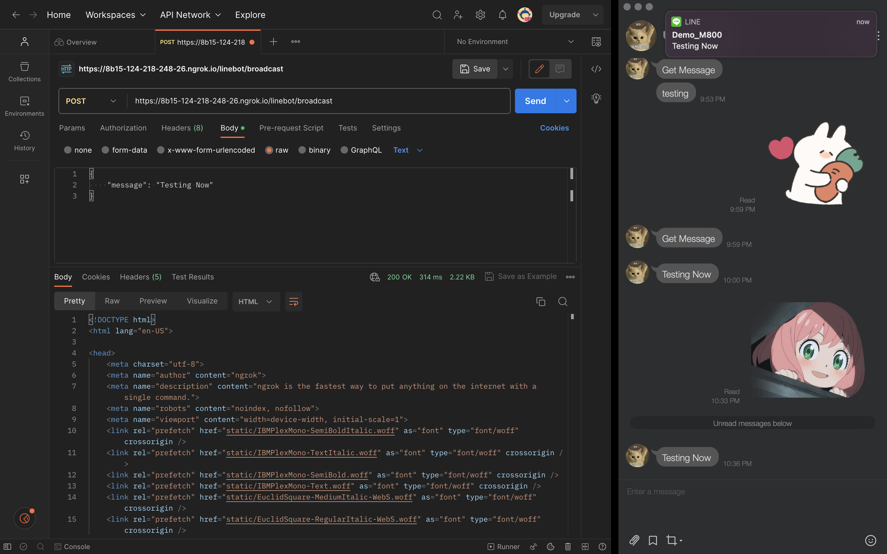

# M800 Backend Homework

## API


## Requirements
- RESTful (JSON format) API
- mongoDB basic operation
- code push to github with proper commit

use below golang libs
- HTTP framework: https://github.com/gin-gonic/gin
- Config: https://github.com/spf13/viper
- mongo driver: https://github.com/mongodb/mongo-go-driver
- cobra: command line tools https://github.com/spf13/cobra

    - commit #1 setup project
    - commit #2 Makefile or a script for local setup and run MongoDB docker (version: 4.4)
    - commit #3 setup necessary config of LINE, MongoDB 
        - Line official account message integration (use go line sdk),
        - Create a test line dev official account
    - commit #4 Create a Go package connect to mongoDB, create a model/DTO to save/query user message to MongoDB
    - commit #5 Create a Gin API
        - receive message from line webhook, save the user info and message in MongoDB
        - (Hint: using ngrok for local test to generate a https endpoint)
    - commit #6 Create a API send message back to line
    - commit #7 Create a API query message list of the user from MongoDB
    - provide a demo video or steps of test (or postman)

## Use this repo
`git clone git@github.com:ushio0107/M800_Backend_Homework.git`

## Prepare
1. Prepare you docker env:
```bash
brew install docker
cd <repo path>/M800_Backend_Homework
make docker_mongo_image
make docker_install
docker ps -a # Confirmed the docker container is running.
```
2. Prepare your ngrok
    1. Go to its page and download.
    2. 
    ```
    cd <path where ngrok.zip is> 
    unzip /path/to/ngrok.zip  
    ./ngrok http 8080
    ```
    3. Get the public address

3. Create your official Line account
    1. Get your own `Channel secret` and  `Channel Access Token`, add them to the repo `/M800_Backend_Homework/config/line_config.yml`
    2. Click toggle `Webhook` to `on`, and add the public address you create by ngrok to `Webhook URL`

4. Config your own settings inside `/M800_Backend_Homework/config/`

5. Add your own keywords inside `./config/keywords.txt`

## Run this repo
`go run main.go`

### Flag
```
Usage:
  m800_homework [flags]

Flags:
  -h, --help               help for m800_homework
      --lineCfg string      (default "./config/line_config.yml")
      --serverCfg string    (default "./config/server_config.yml")
  -t, --toggle             Help message for toggle
```

## Demo
1. Watch the video inside `demo/demo_video.mov`

- `GET https://127.0.0.1/linebot/get`
    - Get all the messages and user info which stored in the MongoDB
    

- `POST https://127.0.0.1/linebot/`
    - Tell the users who sent message to the line bot that the line bot has got the message, and save that message to MongoDB at the same time.
    - There will be a keyword filter. Every time the user sends a message to the line bot, the filter will check if there any sensitive keyword contains. If a sensitive keyword is contained inside the message, the API will response `403` and reply the user that he/she sends a sensitive message.
    

- `POST https://127.0.0.1/linebot/broadcast`
    - Send a message to users.
    

## Note
1. Sensitive keywords are stored inside the MongoDB, with collection `words` in DB `line_bot`, you can manage your sensitive keywords inside the MongoDB. 
2. Keywords inside `./config/keywords.txt` will be inserted to the DB everytime we run this repo, but repeated keywords won't be inserted.